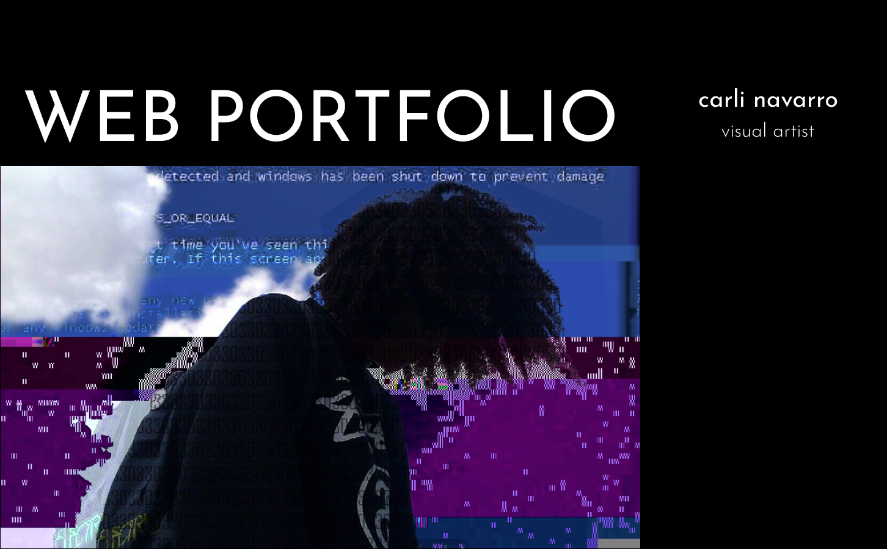
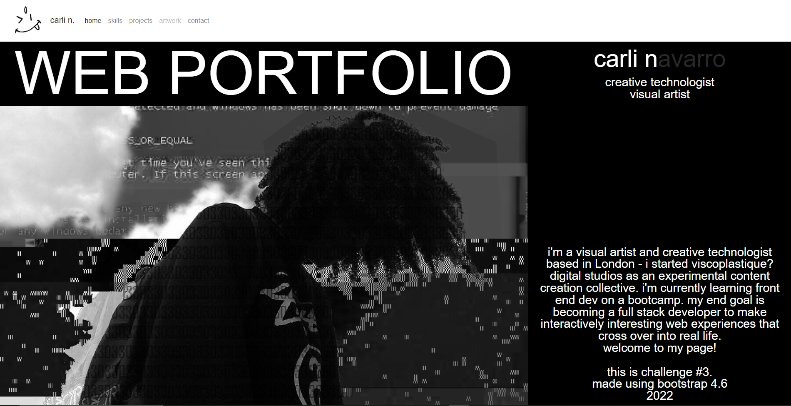

# Bootcamp-Challenge-3-Bootstrap-Portfolio
A development portfolio built using Bootstrap 4.6 built as part of a Front End Dev Bootcamp.

## Description
This repo contains source code for my personal development portfolio built using Bootstrap.

Bootcamp Challenge 3 is to recreate a portfolio focusing on the use of Bootstrap 4.6.

### My User Story:
```
I want to try a new challenging 'artsy' approach to using the columns available using Bootstrap. 
The page will feature a home splash page, a section with my skills, my contact details and previous and future projects.

- A navigation bar

- A hero section

- A work section

- A skills section

- An about/contact section

- An About Me section in the same row.

- A footer section

- All hyperlinks should have a hover effect.

- All buttons should display a box shadow upon hover.
```

### Features:
- Features use of `Bootstrap 4.6s` `rows` and `columns`
- Responsive design using `col-sm- col-md- col-lg-`
- Suitable for Large Laptop, Tablet and Mobile phone. 
- JavaScript powered Nav bar animations

### Wireframe:

### Preview of webpage:


## Installation
N/A

## Usage
Deployed webpage can be found here:  [c4rli's bootstrap portfolio - home](https://c4rli.github.io/Bootcamp-Challenge-3-Bootstrap-Portfolio/)

## Credits
Source code written by carli n. aka c4rli ++

## License
Please refer to the LICENSE in the repo.